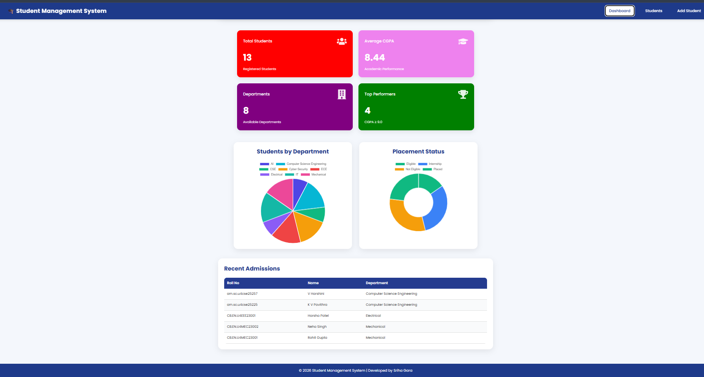
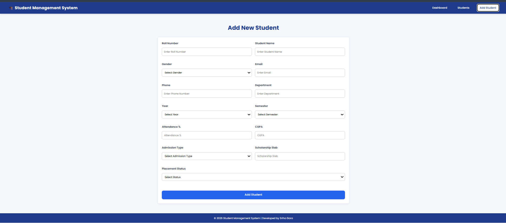
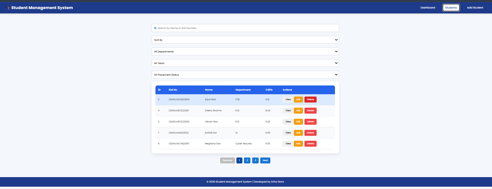
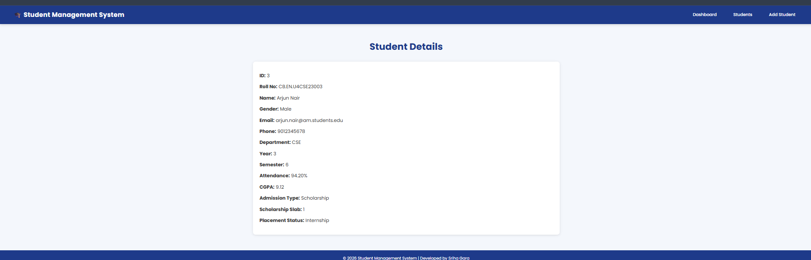

# 🎓 Student Management System

A full-stack **Student Management System** built using the **PERN Stack (PostgreSQL, Express.js, React.js, Node.js)**. The application provides an efficient way to manage student records with complete CRUD functionality, dashboard analytics, and a responsive user interface.

---

## 🌐 Live Demo

**Frontend:** https://recruitment-ashy-chi.vercel.app/

**Backend:** https://recruitment-4.onrender.com

---

## 📌 Project Overview

This project is a full-stack web application that allows users to manage student records efficiently. It integrates a React frontend with an Express.js backend and PostgreSQL database.

---

## ✨ Features

- 📋 View all students
- ➕ Add new student records
- ✏️ Edit student details
- ❌ Delete student records
- 📊 Dashboard with statistics
- 📈 Student analytics using charts
- 🆕 Recent Students section
- 📱 Responsive user interface

---

## 🛠️ Tech Stack

### Frontend
- React.js
- Vite
- HTML5
- CSS3
- JavaScript
- Axios
- React Router DOM
- Chart.js
- React Icons
- React Toastify

### Backend
- Node.js
- Express.js
- REST API

### Database
- PostgreSQL (Neon)

### Deployment
- Frontend: Vercel
- Backend: Render
- Database: Neon

### Tools
- VS Code
- Git & GitHub
- Postman

---

## 📂 Project Structure

```text
Student-Management-System/
│
├── frontend/
│   ├── src/
│   ├── public/
│   ├── package.json
│   └── vite.config.js
│
├── backend/
│   ├── config/
│   ├── controllers/
│   ├── routes/
│   ├── server.js
│   └── package.json
│
├── database/
│   └── schema.sql
│
├── docs/
│   └── screenshots/
│
└── README.md
```

---

## 🚀 Installation & Setup

### 1. Clone the Repository

```bash
git clone https://github.com/srihagara123/Recruitment.git
```

### 2. Navigate to the Project

```bash
cd Recruitment/Student-Management-System
```

### 3. Install Frontend Dependencies

```bash
cd frontend
npm install
```

### 4. Install Backend Dependencies

```bash
cd ../backend
npm install
```

---

## 🗄️ Database Setup

1. Install PostgreSQL or create a Neon PostgreSQL database.
2. Create a new database.
3. Execute the SQL script located in:

```text
database/schema.sql
```

This script will:

- Create the `students` table
- Insert sample student records

---

## 🔑 Environment Variables

Create a `.env` file inside the **backend** folder.

```env
PORT=5000

DB_USER=your_database_username
DB_PASSWORD=your_database_password
DB_HOST=your_database_host
DB_PORT=5432
DB_NAME=your_database_name
```

---

## ▶️ Running the Application

### Start Backend

```bash
cd backend
npm start
```

Backend runs at:

```
http://localhost:5000
```

### Start Frontend

Open another terminal:

```bash
cd frontend
npm run dev
```

Frontend runs at:

```
http://localhost:5173
```

---

## 🔄 API Endpoints

| Method | Endpoint | Description |
|---------|----------|-------------|
| GET | `/api/students` | Get all students |
| GET | `/api/students/:id` | Get student by ID |
| POST | `/api/students` | Add a student |
| PUT | `/api/students/:id` | Update student |
| DELETE | `/api/students/:id` | Delete student |
| GET | `/api/students/recent` | Recent students |
| GET | `/api/students/stats` | Dashboard statistics |
| GET | `/api/students/chart-data` | Chart data |

---
## 📸 Screenshots

### Student Dashboard



### Add Student Form



### Student List



### View Student



---

---

## 🎯 Learning Outcomes

Through this project, I learned:

- Building a complete PERN Stack application
- Designing and consuming REST APIs
- Connecting PostgreSQL with Node.js
- Performing CRUD operations
- Managing frontend-backend communication
- Deploying applications using Vercel and Render
- Hosting PostgreSQL databases using Neon
- Using Git and GitHub for version control

---

## 👩‍💻 Author

**Sriha Gara**

GitHub: https://github.com/srihagara123

---

## 📄 License

This project is developed for learning and academic purposes.

