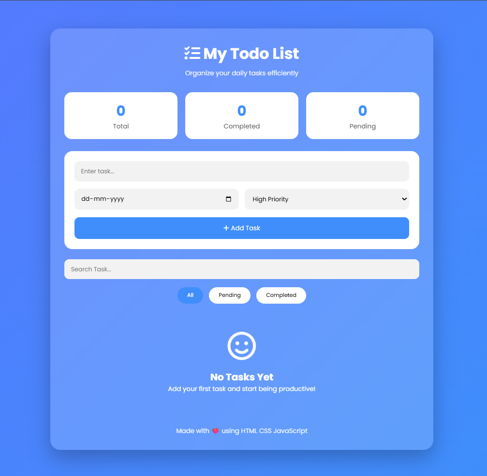
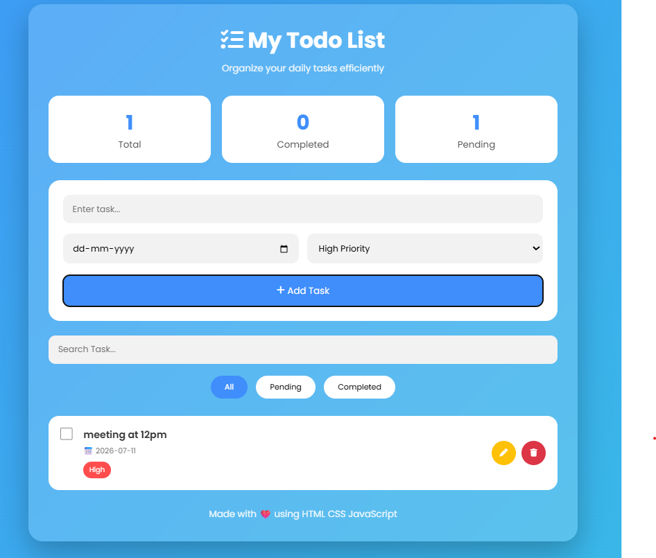
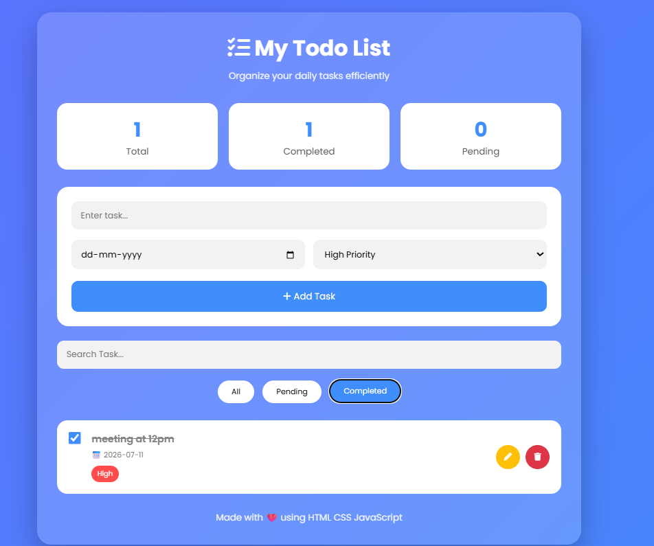

# 📝 To-Do Website

A simple and responsive To-Do List web application built using **HTML, CSS, and JavaScript**. The application helps users organize daily tasks with an intuitive interface and supports complete CRUD (Create, Read, Update, Delete) operations.

---

## 🚀 Features

- ➕ Add new tasks
- 📋 View all tasks
- ✏️ Edit existing tasks
- 🗑️ Delete tasks
- ✅ Mark tasks as completed
- 🔍 Search tasks
- 🎯 Filter tasks (All, Pending, Completed)
- 📅 Set due dates
- 🚩 Set task priority (High, Medium, Low)
- 📊 Task statistics (Total, Completed, Pending)
- 🎨 Modern responsive user interface
- ✨ Smooth animations and transitions

---

## 🛠️ Technologies Used

- HTML5
- CSS3
- JavaScript (ES6)

---

## 📂 Project Structure

```
Todo-Website/
│
├── index.html
├── style.css
├── script.js
├── README.md
└── docs
```

---

## ▶️ How to Run the Project

1. Download or clone the repository.
2. Open the project folder.
3. Double-click `index.html` or open it using any modern web browser.

No installation or additional software is required.

---

## 📖 CRUD Operations

### Create
Add a new task using the input field.

### Read
Display all created tasks.

### Update
Modify an existing task.

### Delete
Remove unwanted tasks.

---

## 📸 Screenshots

### Home Page



### Add Task List



### Completed Task List




---

## 📈 Future Enhancements

- Local Storage support
- Dark Mode
- Categories
- Drag and Drop tasks
- Notifications
- Task reminders

---

## 👩‍💻 Author

**Sriha Gara**

GitHub: https://github.com/srihagara123

---

## 📄 License

This project is created for educational and learning purposes.